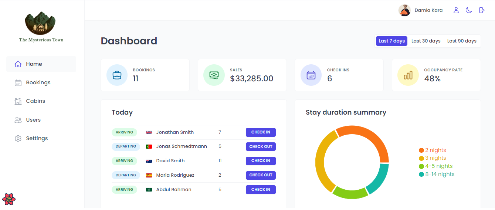
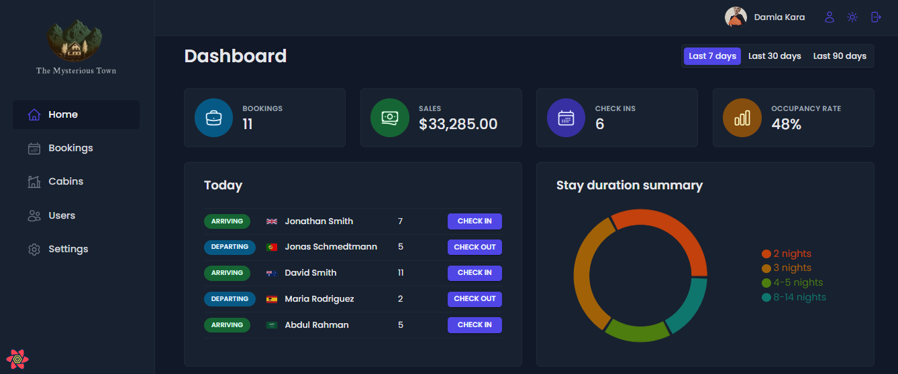
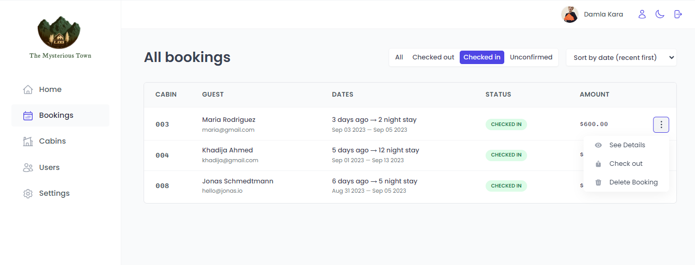

# The Mysterious Town

Internal hotel management app for the "The Mysterious Town" boutique hotel. This is the internal application used inside the hotel to check in guests as they arrive.
## Table of contents

- [Overview](#overview)
  - [The app](#the-app)
  - [Screenshot](#screenshot)
  - [Built with](#built-with)
  - [Used Features](#used-features)
- [Author](#author)

## Overview

### The app

Users should be able to:

- View the optimal layout depending on their device's screen size
- They can log in
- New users can only be signed up inside the application (to guarantee that only actual hotel employees can get accounts)
- Users can be able to upload an avatar, and change their name and password
- They can see all cabins, showing the cabin photo, name, capacity, price, and current discount from the table.
- They can be able to update or delete a cabin, and to create new cabins (including uploading a photo)
- They can view all bookings, showing arrival and departure dates, status,and paid amount, as well as cabin and guest data
- They can filter both the cabins and bookings tables.
- They can use pagination in the tables.
- They can be able to delete, check-in, or check out a booking as the guest arrives
- They can be able to define a few application-wide settings: breakfast price, min and max nights/booking, max guests/booking
- They can see the dashboard with important information and filter these for the last 7, 30, or 90 days
- They can switch between dark and light mode

### Screenshot

### Built with

- React.JS
- React Query
- Vite
- Supabase
- Styled Components
- React Hook Form
- React Router
- Context API
- React Hot Toast

### Used Features
- Rest API
- useState
- useEffect
- localStorage
- useContext
- useForm
- useMutation
- useNavigate
- useQueryClient
- useQuery
- createContext

## Author

- LinkedIn - [Damla Kara](https://www.linkedin.com/in/damla-kara-348081232/)